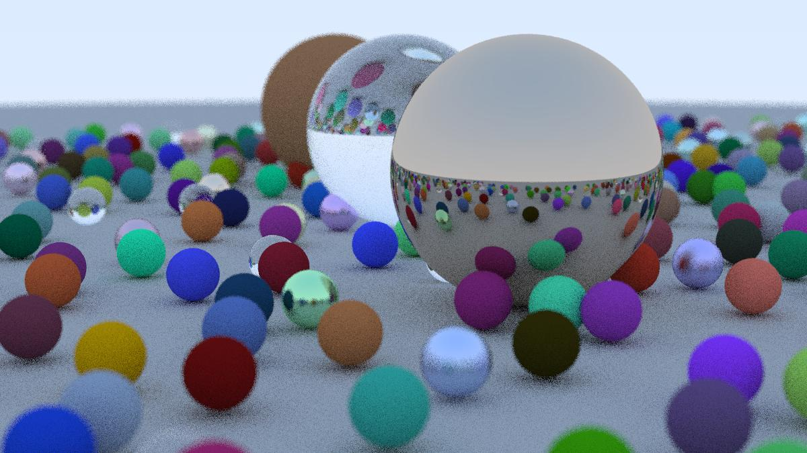

# More notes

These are the notes I generated from [Ray Tracing in One Weekend](https://raytracing.github.io/books/RayTracingInOneWeekend.html), which I did a while back but decided to reformat to post online.

## Header for notes

We have `rtweekend.h` contains basic header information for the project. For my sake the latex here doesn't make stuff vectors.

## Basic Code (1 - 3)

We're going to be using the PPM image format for some of this, which is called the Portable Pixmap Format. It's really easy (and of course inefficient). Theres a header for the type of colors being used, the width/height of the image, the maximum value for each color, and then the rest is the color data. Each row is a pixel in itself:

```ppm
P3
3 2
255
255 0 0
0 255 0
0 0 255
255 255 0
255 255 255
0 0 0
```

Note that it unwraps left and then down a row. This makes outputting text for each pixel and then just putting it into a PPM easy. We use a vscode extension to render ppms.

We have something called `std::clog` and `std::flush` which allows you to push text to buffer and then remove it, giving us a progress bar that isn't actually going to be pushed to the image file.

The `vec3.h` class is just how you would expect a vector in 3D to work, with addition/dot product/cross product/scaling/unit, etc. Nothing here is super novel. The book makes the distinction between `floats` and `doubles` which is simply a precision/size tradeoff.

Similarly the `color.h` class is pretty standard. It is actually just a `vec3` instance where the x, y, z coordinates correspond with the r, g, b of an image (PPM does not support alpha channelling). Here, the input to the stream is a triple of numbers between 0 and 1, and `write_color` outputs the color in the 0...255 range.

This allows us to have pretty efficient handling of image output.

## ~~Rays~~ Paths (4)

A ray is simply a `vec3` instance (shocker) which instead allows you to input the origin/source of the vector and the direction it is pointing in. The direction is the `vec3` instance, the origin is a `point3` instance. This makes shifting vectors to new origins quite easy.

For shading, we need to do:

1. Look from each pixel and figure out how the ray affects it
2. Figure out which objects the ray intersects (ray marching, bounding box, etc)
3. Compute the color at the intersection point.

We need a camera/viewport to actually figure out which pixels we care about. Graphics programming is a balance of converting 3D into nice 2D (rasterization). Also, due to the way PPM works (and most images in general), we need to flip the vertical component in our indexing!!! Remember this before you have an embarrassing bug and pass it off as art.

## Camera (4 middle)

We have an aspect ratio which is really just set by convention and allows for easier scaling. We have to make sure the ratio between the viewport and the render are the same however, so we dont use the aspect ratio on the viewport, instead we use the approximation from the render. This also means we utilize deltas which we get from the viewport. Our camera could be 3x as big as our viewport, meaning we would need a delta of scale 3 to step enough so we have the exact amount of pixels needed. Nice!

The focal length is referred to as the distance between the viewport and the actual camera. Being farther away means you will get wider shots, being closer means you will get more fisheyed and zoomed in pictures.

### Colors (4 End)

In the basic toy example we utilize a linear scaling for colors of rays, which is really nice and easy: $blended value = (1 - a) * startVal + a * endVal$, where $a \in [0, 1]$ and the values are starting colors and ending colors. This lets us get a linear gradient. Programmatically:

```cpp
color ray_color(const ray& r) {
    vec3 unit_direction = unit_vector(r.direction());
    auto a = 0.5*(unit_direction.y() + 1.0);
    return (1.0-a)*color(1.0, 1.0, 1.0) + a*color(0.5, 0.7, 1.0);
}
```

## Sphere (5)

To parameterize a sphere we have $(x_0 - x)^2 + (y_0 - y)^2 + (z_0 - z)^2 = r^2$ with center $(x_0, y_0, z_0)$ and radius $r$. It is not hard to check intersection with a sphere (just check if the distance is within the sphere). In terms of the vector dot product, this is just $(C - P) \cdot (C - P) = r^2$ where $C = (x_0, y_0, z_0)$ and $P$ is a point on the sphere.

A ray is simply a parameterized vector which looks like $P(t) = Q + td$ for $t > 0$, meaning we want to find if there is any $t$ such that $|C - P(t)| = r$ is eventually true. There is some quick mathematics which sets the equation to a quadratic in terms of $t^2$:

$(C - Q - td)\cdot (C - Q - td) = r^2$

$t^2d\cdot d - 2td \cdot (C - Q) + (C - Q)(C - Q) - r^2 = 0$

So, we can check the discriminant of this quadratic to know if there is an intersection. This means computing $(-2d \cdot (C - Q))^2 - 4(d \cdot d)((C - Q) \cdot (C - Q) - r^2)$. If this is negative, then there is no intersection. If this is zero, there is exactly one intersection, two if there is an entry and exit point. In doing this, we have a very quick check if there is a sphere and can return a constant color.

### Simplification (6.2)

Using a change of variables $b = -2h$ you simplify some coefficients in the formula. This is why there is an h in the code and not a b.

### Problems

There are a few problems with this. First, it doesn't respect the constraint $t > 0$ and lacks shading for now, the former which we can compute via actually computing the solutions for $t$ and take the smallest positive one. The other one requires introduction something intrinsic to 3D geometry.

## Refactoring + Surface Normals (6 + 7)

First, we can make a class `hittable.h` which has a hit function and returns if it is hit, sometimes within an input range $t_{min}$ to $t_{max}$. Think of $t_{max}$ like the render distance. So, we define an interval class `interval.h` which acts like $(a, b)$ for some $a, b$. Nothing super interesting but its a useful object to use for later. We can then define objects in general, and store them in a `hittable_list.h`, so we can iterate through objects and track which ones a vector hits and which is the earliest a ray hits. One `c++` programmatic thing being used is `shared_ptr<type>` and `make_shared<type>`, as seen here:

```cpp
hittable_list world;

world.add(make_shared<sphere>(point3(0,0,-1), 0.5));
world.add(make_shared<sphere>(point3(0,-100.5,-1), 100));
```

This is a pointer that retains ownership of the object through the pointer. Think of it like a really nice nametag that multiple people can look at but only one can wear. This is done for nice trash collection, as it dies when it goes out of scope. Finally, refactoring goes nuts in pedagogy. Basically threw all of the code from `main.cc` into `camera.h`.

### Surface Normals

A surface normal is just a unit vector defined at a point on a surface which is perpendicular to the surface at that point. Note that the length does not have to be unit length to be perpendicular, as square roots are in fact expensive, but since the surface normal is a constant (relative to the center/orientation of the surface), we can precompute it instead of while we are rending it. For a sphere, the normal is simply the $(P - C)/r$ where $C$ is the center, $P$ is the point, $r$ is the radius. To compute the color, if we just try to convert the normal to the actual color (as it is a normal vector), we scale it by .5 and add 1 (as the components lie between -1 and 1). This is nice!

Now, consider being inside of a sphere. What would the normal look like? Consider the dot product of the ray and the surface normal. If it is positive, then the ray is inside of the sphere (they align), and if it is negative then it is outside of the sphere. So, we flip the normal whenever the ray is within the sphere and keep track of this information.

## AntiAliasing (8)

Apparently this is also referred to as "anti jaggies" which is very cute, but we effectively want smooth edges, which is done through taking a gaussian average around a point (point sampling). However, this might be flawed, and we want to sample the light falling around the pixel. For simplicity we sample the square region around the pixel and also the 4 neighboring pixels. This will introduce randomness (gasp!). Note that this makes it MUCH slower compared to before, as we are taking 4 random samples for each pixel (is it possible to store them instead?).

```c
color pixel_color(0,0,0);
for (int sample = 0; sample < samples_per_pixel; sample++) {
    ray r = get_ray(i, j);
    pixel_color += ray_color(r, world);
}
write_color(std::cout, pixel_samples_scale * pixel_color); // Computes the average.
```

## Diffuse (9)

Consider an object that does not output light. Then when light hits it, it will reflect off the surface with a random direction, or be absorbed depending on the darkness of the surface. So, we can generate a random ray using our randomization from section 8. However, we do not want the reflection to randomly bounce into the surface, so if it does we invert it (does this change it from being uniform?). Theres also the really dumb rejection method:

```c
inline vec3 random_in_unit_sphere() {
    while (true) {
        auto p = vec3::random(-1,1);
        if (p.length_squared() < 1)
            return p;
    }
}

inline vec3 random_unit_vector() {
    return unit_vector(random_in_unit_sphere());
}
```

*Fun thing to think about then is: come up with an easy programmatic way to uniformly get random vectors that are oriented relative to a surface?*

Next, to check orientation, we take the dot product with the surface normal. If it is positive, it is aligned, if negative, then opposite direction:

```c
inline vec3 random_on_hemisphere(const vec3& normal) {
    vec3 on_unit_sphere = random_unit_vector();
    if (dot(on_unit_sphere, normal) > 0.0) // In the same hemisphere as the normal
        return on_unit_sphere;
    else
        return -on_unit_sphere;
}
```

If there is no absorption, then it is perfectly white. Instead, if it keeps none of its color it is black. This is the darkness.

For this to be a path tracer, it has to trace out the paths of the rays. However, this becomes a recursive problem:

```c
if (world.hit(r, interval(0, infinity), rec)) {
    vec3 direction = random_on_hemisphere(rec.normal);
    return 0.5 * ray_color(ray(rec.p, direction), world);
}
```

This is very computationally expensive as evidenced by my own computer, rip. We just use a pretty cheap depth trick to make sure it doesn't iterate too much, giving us about $(max_depth \cdot samples_per_pixel \cdot num_pixels)$ total operations. Doing a depth on this also reflects darkness adding up.

### Shadow Acne (9.3)

This is kind of why I love GP it's so chaotic!!! Anyway floating point precision makes life really hard and annoying, so we just ignore light bounces that bounce really close to each other. FOr instance, imagine getting a randomized ray that goes into the surface/stays parallel to it, which will immediately intersect the surface again. This gives us no real information, so we can ignore it:

```c
if (world.hit(r, interval(0.001, infinity), rec)) { ... } // Changed from 0 to 0.001 to save acne
```

Note that this wouldn't be feasible for a high renders of small objects, but those are specific usecases that could benefit from running over night :P

### Lambertians (9.4)

Picking a reflected vector at random is generally not the best, since it doesn't accurately reflect the real world. Instead, we can use the Lambertian which utilizes a $\cos$ like distribution relative to the angle between the normal and the ray. This mathematically means that the reflected ray prefers to be closer to the surface normal instead of away from it.

To achieve this, we add a random unit vector to the normal vector. Choose a random point on this sphere. Then consider the ray from the intersection point with the sphere to this random point. This is the Lambertian distribution, and it intuitively makes sense that more of these rays lie along the normal vector. This is ridicuously easy? and we are thankful for it 🙏.

### Gamma Correction (9.5)

Unlike radiation, gamma in an image is to figure out how to smooth the transition from black to white in the context of digital photography. This transformation converts the linear $[0, 1]$ color space into a nonlinear distribution in gamma space. This gamma space is done generally because colors aren't linear (Acerola has a video on this), and to approximate this we simply take the square root of the linear value (read more into what exactly gamma distribution is).

## Metallics (10)

Currently we are using a matte finish on all of our objects in the scene, but this isn't the full scope of textures out there. Here we generalize the notion of materials in a `material.h` class. This class handles:

1. Figuring out the direction of a scattered ray
2. Figuring out the scalar of the attenuation of the scattered ray.

Note this scalar could be zero. This now becomes a prodblem of figuring out the albedo (whitness / fractional reflectance) of scattered vectors depending on the material. Note we can choose to attenuate (absorb/reduce) with some fixed probability or instead reflect with some probability (and have the scalar reflect this probability). Right now it's not too important, so we just scatter every time (up to depth). However, note if the random vector is opposite to the normal vector (or close enough nearby), adding the two together gives us a zero vector. Using `std::fabs` (for absolute value) we can compute if a vector is near zero, and if so discard it.

For metallics specifically, remember how mirros work. A ray gets reflected about the normal:


This is really easy to compute, as $b$ is just $(v \cdot n)n$ (how much v lies with n, scaling n). So we have reflection code, which builds up our reflection class:

```c
class metal : public material {
  public:
    metal(const color& albedo) : albedo(albedo) {}

    bool scatter(const ray& r_in, const hit_record& rec, color& attenuation, ray& scattered)
    const override {
        vec3 reflected = reflect(r_in.direction(), rec.normal); // Reflected Ray
        scattered = ray(rec.p, reflected); // New Scattered Ray
        attenuation = albedo; // Hyperparam
        return true;
    }

  private:
    color albedo;
};
```

So now we initialize materials/objects as so:

```cpp
auto material_ground = make_shared<lambertian>(color(0.8, 0.8, 0.0));
auto material_center = make_shared<lambertian>(color(0.1, 0.2, 0.5));
auto material_left   = make_shared<metal>(color(0.8, 0.8, 0.8));
auto material_right  = make_shared<metal>(color(0.8, 0.6, 0.2));

world.add(make_shared<sphere>(point3( 0.0, -100.5, -1.0), 100.0, material_ground));
world.add(make_shared<sphere>(point3( 0.0,    0.0, -1.2),   0.5, material_center));
world.add(make_shared<sphere>(point3(-1.0,    0.0, -1.0),   0.5, material_left));
world.add(make_shared<sphere>(point3( 1.0,    0.0, -1.0),   0.5, material_right));
```

Now we have colorful metal balls! We can of course add some noise to this, which will look similar to the Lambertian because we want it to line up with the reflected vector. Namely, we will put a small sphere around the reflected vector, and choose a point on that sphere, which we will use as the vector starting from the intersection to this random point. The size of this sphere is how fuzzy the reflection will be. This gives us much more dirty and muted metal surfaces.

## Dielectrics (11)

This is not the one from electromagnetism. Whenever light hits a clear surface, it bends a little bit. In the air, this is zero, but in water this leads to goofy effects like your straw looking funny and fish not being where they're supposed to be. This offset is called the refraction index, which describes how much light bends when entering a material from a vacuum in space (thank you middle school science class). We're going to have to use Snell's law:

> Snell's Law
> Let $\theta, \theta'$ be angles from the normal of the surface, and $\eta, \eta'$ be the respective refractive indices. Then the following equation holds:
> $\eta\sin\theta = \eta'\sin\theta'

More visually:


So, to solve for the angle from the normal, we have to compute $\arcsin$. For brevity we can just utilize the following equations for the parallel and perpendicular components of the refracted ray relative to the normal vector:

$R'_{\perp} = \frac{\eta}{\eta'} (R + n\cos\theta)$

$R'_{\parallel} = - \sqrt{1 - |R'_{\perp}|^2n}$

To compute this fully we need to compute $\cos\theta$ which we utilize the dot product for (assuming n and R are normal):

$R'_{\perp} = \frac{\eta}{\eta'} (R + (-R \cdot n)n)$

To then get the final vector post refraction we add the two components together to get $R' = R'_{\perp} + R'_{\parallel}.$

### Problems (11.3)

Now this is cool and all, but it suffers the problem that Snell's law can in fact output a ray that stays within the material. This is internal reflection, and this appears when you're underwater and looking upwards. Instead of computing $\sin\theta$ directly, we use the dot product and $\sqrt{1 - \cos^2\theta}$ expression to compute it (check for low angle approximation?). If this is too large, then we must have internal reflection.

Note that internal reflection doesn't really happen above water and in air, since air has such a small index of refraction that nothing actually happens. If we instead treat it as if it was underwater (change the ratio of refraction of the sphere to the environment to a larger number), we can simulate things akin to air bubbles.

Another issue that comes up is that the reflectivity of a surface depends on the angle which you view it at. For example, water reflects if you look low enough (which is how you get really cool pictures of Ankor Wat). To approximate this affect, we use a polynomial-approximation by Schlick:

```c
static double reflectance(double cosine, double refraction_index) {
    // Use Schlick's approximation for reflectance.
    auto r0 = (1 - refraction_index) / (1 + refraction_index); // (1 - eta / eta') / (1 + eta / eta') = (eta' - eta) / (eta' + eta)
    r0 = r0*r0; // (eta' - eta)^2 / (eta' + eta)^2
    return r0 + (1-r0)*pow((1 - cosine),5); // x + (1 - x) * (1 - cos(theta))^5 is Schlick's polynomial approximation.
}
```

We can check for this to see if we should reflect. Also, to have a sphere be hollow, we can just have a new sphere inside of the external sphere which the hittable list handles first, so the path of the ray refracts at the correct time. This is already handled due to the way we set up rays:

```cpp
auto material_left   = make_shared<dielectric>(1.50);
auto material_bubble = make_shared<dielectric>(1.00 / 1.50);
world.add(make_shared<sphere>(point3(-1.0,    0.0, -1.0),   0.5, material_left));
world.add(make_shared<sphere>(point3(-1.0,    0.0, -1.0),   0.4, material_bubble));
```

## Camera (12)

Here we add field of view as a hyperparameter (think about the minecraft slider) to have more control over the images. This just changes the start and end steps that we make for each pixel in the 3D space, which makes it clear that we have TWO fov parameters, one for horizontal and vertical steps. The field of view's height scales with $\tan(\theta/2)$, which is set to 90 deg so that the fov doesn't warp distances too much. Having a higher fov makes for a wider shot, and having a smaller one makes it more pointed.

We would also like to move our camera around the scene (position / direction) as if it was a video game. This leads into airplane mechanics. Imagine you're flying an airplane. You have 3 numbers to describe your position in space. You also have 3 numbers to describe the direction you're facing. You have a secret other number which describes the rotation you have about this direction. This is 7 parameters. To capture this, we need a notion of the up direction for a camera. As long as this isn't the same direction as the view direction we are fine. This in fact reduces it to 6 parameters, as we make the direction parameter relative to the rotation we undergo, as long as we have a fixed notion of what up is.

This is all mostly linear algebra, and I directly copy the description of the orthonormal basis I lightly touched on:

> $u$ will be the unit vector pointing to camera right, $v$ is the unit vector pointing to camera up, $w$ is the unit vector pointing opposite the view direction (since we use right-hand coordinates), and the camera center is at the origin.

This simply changes the frame of reference and focal length for the rays that we utilize in our calculations. For example:

```c
// Calculate the u,v,w unit basis vectors for the camera coordinate frame.
w = unit_vector(lookfrom - lookat);
u = unit_vector(cross(vup, w));
v = cross(w, u);

// Calculate the vectors across the horizontal and down the vertical viewport edges.
vec3 viewport_u = viewport_width * u;    // Vector across viewport horizontal edge
vec3 viewport_v = viewport_height * -v;  // Vector down viewport vertical edge

// Calculate the location of the upper left pixel.
auto viewport_upper_left = center - (focal_length * w) - viewport_u/2 - viewport_v/2;
```

Note that field of view affects `viewport_{width, height}`.

## Blur (13)

Last section!

This is photographically known as the depth of field of an image, but is technically called the defocus blur (which is also just a better name). In a digital world, this isn't accurately captured since everything is passing through the viewport instead of a small pinhole. In a small pinhole, things that are too close or too far get blurred due to the light getting bent too much once it hits a lens. The objects that are at the right distance to be focused are known as laying on the focus plane.

Computationally, we don't actually make a lens object. Rather, we treat the lens as an infinitely thin circular lens and start from there. Now that we're at the end, we have this pipeline:

1. Make the focus plane orthogonal to the camera view.
2. Compute focus distance from the distance between the camera center and the focus plane.
3. The viewport lives on the focus plane, centered at camera view direction.
4. Pixels from the camera lay inside of the viewport.
5. Sample new rays around the current pixel to prevent aliasing.
6. The camera fires rays from random points on the lens through the current image sample location.

This sixth step is the one we care about now. Currently we have a disk of radius zero which we blur through, and so we wish to increase this. We need a random vector that lies within a disk:

```c
inline vec3 random_in_unit_disk() {
    while (true) {
        auto p = vec3(random_double(-1,1), random_double(-1,1), 0);
        if (p.length_squared() < 1)
            return p;
    }
}
```

These are the ones that we'll use to get rays. But in terms of the blurring, it's effectively just fixing the focus distance:

```c
auto viewport_height = 2 * h * focus_dist;
auto viewport_upper_left = center - (focus_dist * w) - viewport_u/2 - viewport_v/2;
auto defocus_radius = focus_dist * tan(degrees_to_radians(defocus_angle / 2));
```

So now we can do some digital photography for spheres!

## Final Renders (14)

I hacked together some code to make a PPM to JPG converter:

```python
from PIL import Image
im = Image.open("image.ppm")
im.save("image.jpg")
```

Here it is:



While this course doesn't always teach you how to code it (since much of it is actually quite simple due to the PPM formatting), it teaches you the basics of graphics programming in a very quick way. 9/10 course. I think it accomplishes its goals and I know about other sources to go further in depth to things I care about (such as blurring).

I kind of wish it had a light section on GPU optimization as the last one can take a while if you increase samples too much. Setting it to 10 still leaves it pretty slow (though my computer is not necessarily the fastest thing out there).

This course also should make it more clear that this is a path tracer and not a ray tracer. I also kind of wish it went over triangles in this section, though spheres are quite easy. The next one (notes will be posted eventually) goes over quads as the base 2D primitive.

## Citation

[*Ray Tracing in One Weekend*](https://raytracing.github.io/books/RayTracingInOneWeekend.html)
